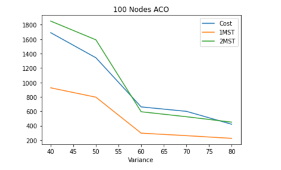
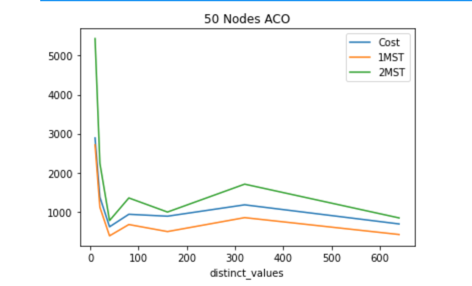
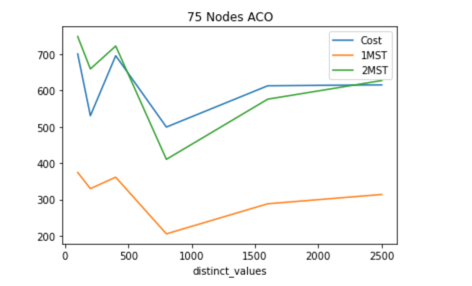

***Observation and Trend with Variance***
1. The observation and conclusion were similar to Branch to Bound Algorithm.
1. The optimal TSP solution on a weighted graph always lies within the 1-MST and 2-MST. 
2. A TSP solution below 1MST is not admissible and solutions above 2MST are admissible but they are generally sub-optimal.
3. We observed that for a fixed number of nodes/vertices, when variance increases, the optimal solution tend to drift towards 2MST.

4. The above plot demonstrates 200- simulations for Ant Colony Optimization Algorithm for a 100 Node graph with increasing variance. The mean was kept constant at 100.
5. It was observed that, for lower variance the TSP solution lies close to 1-MST and for larger value of variance the TSP solution is closer to 2-MST. It was also noticed that
for higher values of variation, 2000 cycles were not enough to give solution between 1-MST and 2-MST. However, with higher number of cycles and increased time duration, it is highly likely that Ant Colony Optimization will find an 
optimal path under 2-MST.  
6. _Explanation_: The variance essentially indicates the standard deviation around the mean value. Thus, a lower variance indicates cost of edges are closer to one another. 
In other words, the difference between the cost of two edges will be low. This idea can be extrapolated over
all edges of a graph. This essentially means that there is a higher probability of finding a TSP solution which will be closer to 1MST. As the fluctuations between 
cost of edges are low, the TSP solution which is found will always be closer to 1-MST. However, when variance 
increases the difference between two edges in general also tends to be higher. The immediate conclusion that can be derived from increasing variance will be that the
value of 1-MST (and 2-MST) will be lower compared to higher variance. This is because, the lower edge value will give us MST value. However, in this case since 
fluctuations between edge size is higher an optimal TSP path tend to lie near 2-MST.

***Observation and Trend with varying K (Distinct Values)***
1. A similar experiment was conducted for varying value of K while keeping the node and variance constant.
2. In this case, we simulated two scenarios, one with mid sized value of variance (Number of Node = 50 and Variance = 50)
and other with high variance value (Number of Node = 75 and Variance = 80).
 
3. It appears that higher value of K may drift the solution towards 2-MST. However, no conclusive trend was noticed. 