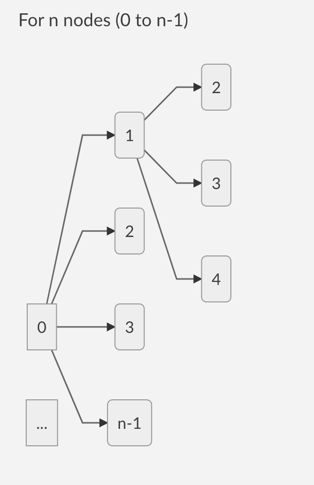
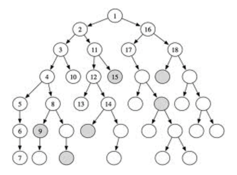
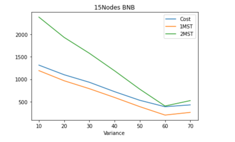

# ICS 271P Fall2020
### Lecture P: Introduction to Artificial Intelligence  (35260)
### Project Final Report
### Traveling Salesman Problem with SLS & BnB-DFS

##### Maaz Syed Adeeb ()
##### Shuvam Ghosh (shuvamg)
##### Kumar Vaibhav (kvaibhav)

## Define problem you are solving (be brief)
The **travelling salesman problem** (also called the **traveling salesperson problem**(**TSP**) asks the following question: "Given a list of cities and the distances between each pair of cities, what is the shortest possible route that visits each city exactly once and returns to the origin city?" It is an **NP-hard** problem in combinatorial optimization important in theoretical computer science and operations research.

## Describe your approach

**Branch and Bound DFS with MST based heuristic:**

Branch and Bound DFS uses a depth first approach to incrementally construct an MST with various set of nodes and get a cost which decides whether to expand a particular node in the BnB state space.

Each state space in the BnB has the following parameters:-

**1. Upperbound (U):** An upperlimit that stores the best TSP path found so far.

**2. Lowerbound (L):** A value obtained after including path cost for nodes already explored in the BnB state space and the MST cost calculated after adding the remaining unexplored nodes.

    Lower bound = cost of path to reach the current state in BnB + MST obtained from the remaining nodes.

The BnB state space looks as show:

**Pruning Condition:**
When at any instance we get the lowerbound value to be more than or equals to the upperbound (best TSP found so far), we do not expand the node.

> if (L >= U) -> (prune)

**Describe/analyze properties**

In the worst cast the branch and bound recursive call is called n! times.
Typically we can view a branch-and-bound algorithm as a tree search. 

At any node of the tree, the algorithm must make a finite decision and set one of the unbound variables. Suppose that each variable is only 0-1 valued. Then at a node where the variable  is on-tap, the algorithm must decide whether or not  or  is the right choice. In a brute-force search both choices would be examined. 
In the BB case the algorithm tries to avoid searches that are “useless.”

At every BNB 

**Make observations, assess performance, describe/analyze (experimental) results**

**why something does work; why something does not work (well)?**

**when/under what circumstances does you approach/algorithm work?**

**why your program fails on some problems (instances), while working well on other problems (instances)?**

***Scenario for good performance***
1. The BnB state space expands all the node to full depth in the first run. The TSP obtained after this first expansion is set as an upperlimit that serves as a check for subsequent pruning. This first upperlimit however can be a poor TSP cost that may not ensure effective pruning causing the algorithm to run endlessly trying to expand each and every node and calculating MSTs.

***Observation and Trend with Variance***
1. The optimal TSP solution on a weighted graph always lies within the 1-MST and 2-MST. 
2. A TSP solution below 1MST is not admissible and solutions above 2MST are admissible but they are generally sub-optimal.
3. We observed that for a fixed number of nodes/vertices, when variance increases, the optimal solution tend to drift towards 2MST.

4. The above plot demonstrates a complete run of Branch and Bound Algorithm for a 15 Node graph with increasing variance. The mean was kept constant at 100.
5. It was observed that, for lower variance the TSP solution lies close to 1-MST and for larger value of variance the TSP solution is closer to 2-MST.
6. _Explanation_: The variance essentially indicates the standard deviation around the mean value. Thus, a lower variance indicates cost of edges are closer to one another. 
In other words, the difference between the cost of two edges will be low. This idea can be extrapolated over
all edges of a graph. This essentially means that there is a higher probability of finding a TSP solution which will be closer to 1MST. As the fluctuations between 
cost of edges are low, the TSP solution which is found will always be closer to 1-MST. However, when variance 
increases the difference between two edges in general also tends to be higher. The immediate conclusion that can be derived from increasing variance will be that the
value of 1-MST (and 2-MST) will be lower compared to higher variance. This is because, the lower edge value will give us MST value. However, in this case since 
fluctuations between edge size is higher an optimal TSP path tend to lie near 2-MST.          

***Observation and Trend with varying K (Distinct Values)***
1. A similar experiment was conducted for varying value of K while keeping the node and variance constant.
2. We did not notice any conclusive observation in this case. 
***Scenario for good performance***
1. If the first upper-limit is found to be a relatively good solution, this can lead to better pruning causing the algorithm to terminate quicker with a good upperlimit.

**Describe how you did improve (or would improve) your algorithm based on your assessment/observation of the results**

One possible idea for improvement would be to choose heuristic calculation for the next node that is nearest to the latest node traversed so far. 

**References**

[0] https://rjlipton.wordpress.com/2012/12/19/branch-and-bound-why-does-it-work/

[1] http://citeseerx.ist.psu.edu/viewdoc/download?doi=10.1.1.104.9895&rep=rep1&type=pdf

[2] https://www.youtube.com/watch?v=qK1BFAk04h0&t=1230s

