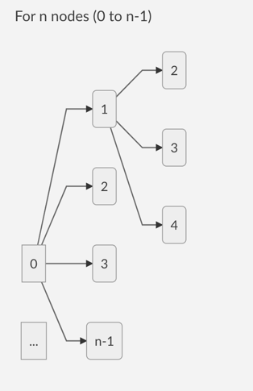
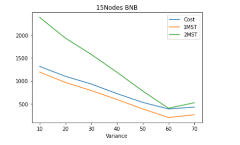
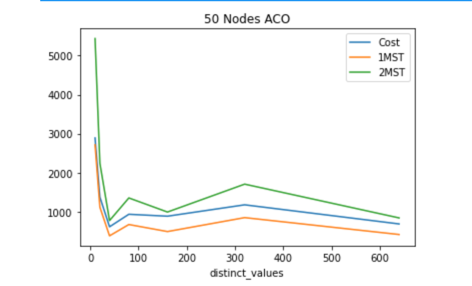
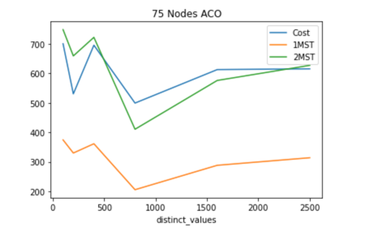

# ICS 271P Fall2020 - Project Final Report

# Team

1. Maaz Syed Adeeb (adeebm)
1. Shuvam Ghosh (shuvamg)
1. Kumar Vaibhav (kvaibhav)

# Traveling Salesman Problem

## Problem Definition

The **travelling salesman problem** (also called the **traveling salesperson problem**(**TSP**)) asks the following question: "Given a list of cities and the distances between each pair of cities, what is the shortest possible route that visits each city exactly once and returns to the origin city?" It is an **NP-hard** problem in combinatorial optimization that is important in theoretical computer science and operations research.

## Observations on TSP

### Relation with Minimum Spanning Tree

We've learned an interesting relation between an optimal TSP tour and a minimum spanning tree (MST) of a given graph.

> The cost of an optimal TSP tour lies between the cost of a MST and 2 times the cost of the same MST

The lower bound of 1-MST (this is the cost of the MST) holds because a MST connects all the vertices of a graph and one **has** to visit all the vertices for a valid TSP tour.

The upper bound of 2-MST (this is twice the cost of an MST) holds because one can visit all the vertices of the graph and reach back the starting vertex by traversing each edge twice.

We have used this relation as a guiding light to determine how close to the optimal our solutions are. While we've gone over the upper bound of 2-MST in multiple instances, due to various reasons outlined later on, we've always been above the lower bound of 1-MST.

A TSP solution below 1-MST is not admissible and solutions above 2-MST are admissible but they are generally sub-optimal.

# Branch and Bound DFS - BnB DFS

## Approach

### Branch and Bound DFS with MST based heuristic

Branch and Bound DFS uses a depth first approach to incrementally construct a MST with various set of nodes and get a cost which decides whether to expand a particular node in the BnB state space.

Each state space in the BnB has the following parameters:-

**1. Upperbound (U):** An upperlimit that stores the best TSP path found so far.

**2. Lowerbound (L):** A value obtained after including path cost for nodes already explored in the BnB state space and the MST cost calculated after adding the remaining unexplored nodes.

> Lower bound = cost of path to reach the current state in BnB + MST obtained from the remaining nodes.

The BnB state space looks as shown:



### Pruning Condition

When at any instance we get the lowerbound value to be more than or equals to the upperbound (best TSP found so far), we do not expand the node.

> if (L >= U) -> (prune)

## Properties

In the worst cast the branch and bound recursive call is called `n!` times.
Typically we can view a branch-and-bound algorithm as a tree search.

At any node of the tree, the algorithm must make a finite decision and set one of the unbound variables. In a brute-force search all choices would be examined.
In the BnB case the algorithm tries to avoid searches that are "useless" based on the pruning condition stated above.


## Observations

### Results with increasing variance

1. We observed that for a fixed number of vertices, when variance increases, the optimal solution tends to drift towards 2MST.
   
1. The above plot demonstrates a complete run of BnB Algorithm for a 15 Node graph with increasing variance. The mean was kept constant at 100.
1. It was observed that, for lower variance the TSP solution lies close to 1-MST and for larger value of variance the TSP solution is closer to 2-MST.
1. The variance essentially indicates the standard deviation around the mean value. Thus, a lower variance indicates cost of edges are closer to one another. In other words, the difference between the cost of two edges will be low. This idea can be extrapolated over all edges of a graph. This essentially means that there is a higher probability of finding a TSP solution which will be closer to 1-MST. As the fluctuations between cost of edges are low, the TSP solution which is found will always be closer to 1-MST. However, when variance increases the difference between two edges in general also tends to be higher. The immediate conclusion that can be derived from increasing variance will be that the value of 1-MST (and 2-MST) will be lower compared to higher variance. This is because, the lower edge value will give us MST value. However, in this case since fluctuations between edge size is higher an optimal TSP path tend to lie near 2-MST.

### Results with varying distinct values (k)

1. A similar experiment was conducted for varying value of k while keeping the node and variance constant.
1. We did not notice any conclusive observation in this case.

### Scenario for Bad Performance

The BnB state space expands all the node to full depth in the first run. The TSP obtained after this first expansion is set as an upperlimit that serves as a check for subsequent pruning. This first upperlimit however can be a poor TSP cost that may not ensure effective pruning causing the algorithm to run endlessly trying to expand each and every node and calculating MSTs.

### Scenario for Good Performance

If the first upper-limit is found to be a relatively good solution, this can lead to better pruning causing the algorithm to terminate quicker

## Scope for improvement

1. One possible idea for improvement would be to choose a heuristic calculation for the next node to be examined. We could use nearest neighbor heuristic to do so
1. Choosing more accurate heuristics for calculating the lower bound would also help. We have looked at Christophide's Heuristic, 1-tree heuristic, 2-opt etc.

# Stochastic Local Search - Ant Colony Optimization

## Approach

We implement Stochastic Local Search (SLS) using Ant Colony Optimization (ant-cycle algorithm).

The idea is to use multiple agents that emulate ants to find various valid tours, and store the best possible tour. The ants choose the next vertex to visit based on a probabilistic function which depends on the distance to a node and the "pheromone" that is dropped by previous visits. The pheromone concept is directly derived from how real ants communicate previously found paths to food.

We also have a way to diminish the amount of pheromone in every cycle, as we don't want the algorithm to get stuck in following previous paths blindly, that is, a local optima.

## Properties

The running complexity of the algorithm is `O(NC * n^3)`, where `NC` is the number of cycles that the ants are made to go around the graph and `n` is the number of vertices.

The most expensive operation in the algorithm happens to be where we move each ant in each cycle. The pseudocode is roughly

```
for c in range(1, NC):
	for i in range(1, n):
		for ant in ants:
			find probability distribution P of the next nodes of i
			ant.moveTo(j with probability P(i,j))
```

It's worth mentioning here that the number of ants are linearly related to the number of vertices.

## Observations

### Results with increasing variance

1. The observation and conclusion were similar to BnB Algorithm.
1. We observed that for a fixed number of nodes/vertices, when variance increases, the optimal solution tend to drift towards 2MST.
   
1. The above plot demonstrates 2000 simulations for ACO for a 100 Node graph with increasing variance. The mean was kept constant at 100.
1. It was also noticed that for higher values of variance, 2000 cycles were not enough to give solution between 1-MST and 2-MST. However, with higher number of cycles and increased time duration, it is highly likely that ACO will find an optimal path under 2-MST.

### Results with varying distinct values (k)

1. A similar experiment was conducted for varying value of k while keeping the node and variance constant.
1. In this case, we simulated two scenarios, one with mid sized value of variance (Number of Node = 50 and Variance = 50) and other with high variance value (Number of Node = 75 and Variance = 80).
   
   
1. It appears that higher value of k may drift the solution towards 2-MST. However, no conclusive trend was noticed.

### Visulazing the pheromones

We visualized the pheremone levels after solving a 10 node problem. The path that was chosen `1->8->9->5->6->7->2->0->4->3->1` is highlighted in green


The size of edges are proportional to the pheromone on them. We can notice that even though the pheromone is high on some edges, the final path did not include them, for example `0-8`. This helps us understand the stochastic nature of the algorithm and also clearly visualizes its effects

The values for the pheremone levels are provided as reference in the appendix.

# Appendix

## SLS Ant Colony Optimization

| problem                              | cost        | num_of_cycles |
| ------------------------------------ | ----------- | ------------- |
| tsp-problem-25-6-100-5-1.txt         | 2491.939304 | 2000          |
| tsp-problem-25-6-100-25-1.txt        | 1404.137033 | 2000          |
| tsp-problem-25-31-100-5-1.txt        | 2339.468691 | 2000          |
| tsp-problem-25-31-100-25-1.txt       | 1367.284097 | 2000          |
| tsp-problem-25-62-100-5-1.txt        | 2362.710221 | 2000          |
| tsp-problem-25-62-100-25-1.txt       | 1552.887191 | 2000          |
| tsp-problem-25-125-100-5-1.txt       | 2333.831475 | 2000          |
| tsp-problem-25-125-100-25-1.txt      | 1505.273657 | 2000          |
| tsp-problem-25-250-100-5-1.txt       | 2338.97813  | 2000          |
| tsp-problem-25-250-100-25-1.txt      | 1420.152134 | 2000          |
| tsp-problem-50-25-100-5-1.txt        | 4745.835979 | 2000          |
| tsp-problem-50-25-100-25-1.txt       | 2202.783715 | 2000          |
| tsp-problem-50-125-100-5-1.txt       | 4595.685873 | 2000          |
| tsp-problem-50-125-100-25-1.txt      | 3111.091148 | 2000          |
| tsp-problem-50-250-100-5-1.txt       | 4651.221797 | 2000          |
| tsp-problem-50-250-100-25-1.txt      | 2545.744892 | 2000          |
| tsp-problem-50-500-100-5-1.txt       | 4672.33882  | 2000          |
| tsp-problem-50-500-100-25-1.txt      | 2810.933178 | 2000          |
| tsp-problem-50-1000-100-5-1.txt      | 4654.035126 | 2000          |
| tsp-problem-50-1000-100-25-1.txt     | 2531.856005 | 2000          |
| tsp-problem-75-56-100-5-1.txt        | 7072.882614 | 2000          |
| tsp-problem-75-56-100-25-1.txt       | 3988.140794 | 2000          |
| tsp-problem-75-281-100-5-1.txt       | 6953.882049 | 2000          |
| tsp-problem-75-281-100-25-1.txt      | 3672.898225 | 2000          |
| tsp-problem-75-562-100-5-1.txt       | 6950.770711 | 2000          |
| tsp-problem-75-562-100-25-1.txt      | 3450.656755 | 2000          |
| tsp-problem-75-1125-100-5-1.txt      | 6965.629447 | 2000          |
| tsp-problem-75-1125-100-25-1.txt     | 3809.241507 | 2000          |
| tsp-problem-75-2250-100-5-1.txt      | 6971.348191 | 2000          |
| tsp-problem-75-2250-100-25-1.txt     | 3747.759087 | 2000          |
| tsp-problem-100-100-100-5-1.txt      | 9258.847079 | 2000          |
| tsp-problem-100-100-100-25-1.txt     | 4253.50708  | 2000          |
| tsp-problem-100-500-100-5-1.txt      | 9270.700905 | 2000          |
| tsp-problem-100-500-100-25-1.txt     | 4674.511818 | 2000          |
| tsp-problem-100-1000-100-5-1.txt     | 9192.683953 | 2000          |
| tsp-problem-100-1000-100-25-1.txt    | 4413.740764 | 2000          |
| tsp-problem-100-2000-100-5-1.txt     | 9217.221895 | 2000          |
| tsp-problem-100-2000-100-25-1.txt    | 4722.02898  | 2000          |
| tsp-problem-100-4000-100-5-1.txt     | 9188.570051 | 2000          |
| tsp-problem-100-4000-100-25-1.txt    | 4617.953919 | 2000          |
| tsp-problem-200-400-100-5-1.txt      | 18418.40689 | 175           |
| tsp-problem-200-400-100-25-1.txt     | 7403.44757  | 46            |
| tsp-problem-200-2000-100-5-1.txt     | 18379.63439 | 111           |
| tsp-problem-200-2000-100-25-1.txt    | 9150.583847 | 46            |
| tsp-problem-200-4000-100-5-1.txt     | 18391.42144 | 87            |
| tsp-problem-200-4000-100-25-1.txt    | 8169.16698  | 77            |
| tsp-problem-200-8000-100-5-1.txt     | 18389.85279 | 96            |
| tsp-problem-200-8000-100-25-1.txt    | 8081.780396 | 62            |
| tsp-problem-200-16000-100-5-1.txt    | 18388.66769 | 107           |
| tsp-problem-200-16000-100-25-1.txt   | 8118.06007  | 62            |
| tsp-problem-300-900-100-5-1.txt      | 27188.86901 | 142           |
| tsp-problem-300-900-100-25-1.txt     | 11731.25879 | 62            |
| tsp-problem-300-4500-100-5-1.txt     | 27331.80468 | 134           |
| tsp-problem-300-4500-100-25-1.txt    | 11368.94872 | 87            |
| tsp-problem-300-9000-100-5-1.txt     | 27358.72937 | 150           |
| tsp-problem-300-9000-100-25-1.txt    | 11577.00537 | 74            |
| tsp-problem-300-18000-100-5-1.txt    | 27324.61926 | 177           |
| tsp-problem-300-18000-100-25-1.txt   | 11672.00547 | 89            |
| tsp-problem-300-36000-100-5-1.txt    | 27322.87565 | 105           |
| tsp-problem-300-36000-100-25-1.txt   | 11199.67358 | 42            |
| tsp-problem-400-1600-100-5-1.txt     | 36295.4009  | 131           |
| tsp-problem-400-1600-100-25-1.txt    | 13889.23477 | 67            |
| tsp-problem-400-8000-100-5-1.txt     | 36110.119   | 105           |
| tsp-problem-400-8000-100-25-1.txt    | 14351.53734 | 120           |
| tsp-problem-400-16000-100-5-1.txt    | 36319.5187  | 126           |
| tsp-problem-400-16000-100-25-1.txt   | 13780.73854 | 66            |
| tsp-problem-400-32000-100-5-1.txt    | 36235.44956 | 139           |
| tsp-problem-400-32000-100-25-1.txt   | 14338.8169  | 48            |
| tsp-problem-400-64000-100-5-1.txt    | 36136.90623 | 184           |
| tsp-problem-400-64000-100-25-1.txt   | 13834.26264 | 50            |
| tsp-problem-600-3600-100-5-1.txt     | 54172.81651 | 81            |
| tsp-problem-600-3600-100-25-1.txt    | 23182.16222 | 42            |
| tsp-problem-600-18000-100-5-1.txt    | 54308.37565 | 83            |
| tsp-problem-600-18000-100-25-1.txt   | 18754.64938 | 75            |
| tsp-problem-600-36000-100-5-1.txt    | 54440.4311  | 85            |
| tsp-problem-600-36000-100-25-1.txt   | 19157.80257 | 58            |
| tsp-problem-600-72000-100-5-1.txt    | 54307.40554 | 81            |
| tsp-problem-600-72000-100-25-1.txt   | 19476.63641 | 68            |
| tsp-problem-600-144000-100-5-1.txt   | 54441.0801  | 83            |
| tsp-problem-600-144000-100-25-1.txt  | 19315.74521 | 47            |
| tsp-problem-800-6400-100-5-1.txt     | 74948.2477  | 31            |
| tsp-problem-800-6400-100-25-1.txt    | 20664.08734 | 32            |
| tsp-problem-800-32000-100-5-1.txt    | 74805.58028 | 33            |
| tsp-problem-800-32000-100-25-1.txt   | 23795.02859 | 32            |
| tsp-problem-800-64000-100-5-1.txt    | 74858.77532 | 33            |
| tsp-problem-800-64000-100-25-1.txt   | 23912.4448  | 32            |
| tsp-problem-800-128000-100-5-1.txt   | 74841.06047 | 33            |
| tsp-problem-800-128000-100-25-1.txt  | 23868.20155 | 31            |
| tsp-problem-800-256000-100-5-1.txt   | 75077.85861 | 31            |
| tsp-problem-800-256000-100-25-1.txt  | 24243.84929 | 31            |
| tsp-problem-1000-10000-100-5-1.txt   | 97201.91528 | 16            |
| tsp-problem-1000-10000-100-25-1.txt  | 29405.53047 | 16            |
| tsp-problem-1000-50000-100-5-1.txt   | 97424.85043 | 16            |
| tsp-problem-1000-50000-100-25-1.txt  | 30307.89593 | 16            |
| tsp-problem-1000-100000-100-5-1.txt  | 97647.44971 | 15            |
| tsp-problem-1000-100000-100-25-1.txt | 28681.85537 | 15            |
| tsp-problem-1000-200000-100-5-1.txt  | 97451.3135  | 16            |
| tsp-problem-1000-200000-100-25-1.txt | 28619.64424 | 16            |
| tsp-problem-1000-400000-100-5-1.txt  | 97403.66069 | 16            |
| tsp-problem-1000-400000-100-25-1.txt | 29387.56907 | 15            |

### Pheromone matrix

```
[[0.0, 0.3733482486144805, 0.4548245153192971, 0.08997471294392687, 1.9644030641503931, 0.08933940202208684, 0.3738693380809528, 0.2991637796975064, 1.175799037768375, 0.3492637742563175],
[0.3733482486144805, 0.0, 0.21645487663647744, 1.1245541751709427, 0.372529632928842, 1.194448515135806, 0.006076922649856098, 0.11755752881985351, 1.2941038952869024, 0.4709120776101753],
[0.4548245153192971, 0.21645487663647744, 0.0, 0.4426700244163062, 0.4305165558124842, 0.8992780682758418, 0.12020981823438609, 2.2417064549952372, 0.2822307038231714, 0.08209485534013478],
[0.08997471294392687, 1.1245541751709427, 0.4426700244163062, 0.0, 1.5819345158930214, 0.048389837617845266, 1.3653666023124371, 0.084966899274669, 3.2472840690841374E-5, 0.43209663238349677],
[1.9644030641503931, 0.372529632928842, 0.4305165558124842, 1.5819345158930214, 0.0, 0.4153153717109051, 0.04161789316003515, 0.2923454755569072, 1.6361134770695426E-5, 0.07130700250597716],
[0.08933940202208684, 1.194448515135806, 0.8992780682758418, 0.048389837617845266, 0.4153153717109051, 0.0, 1.1944110009554838, 0.30378712952313125, 1.492412658068319E-4, 1.024867306346429],
[0.3738693380809528, 0.006076922649856098, 0.12020981823438609, 1.3653666023124371, 0.04161789316003515, 1.1944110009554838, 0.0, 0.6564838806090971, 0.11677746570287965, 1.295172951148208],
[0.2991637796975064, 0.11755752881985351, 2.2417064549952372, 0.084966899274669, 0.2923454755569072, 0.30378712952313125, 0.6564838806090971, 0.0, 1.015290073072538, 0.1586846513043963],
[1.175799037768375, 1.2941038952869024, 0.2822307038231714, 3.2472840690841374E-5, 1.6361134770695426E-5, 1.492412658068319E-4, 0.11677746570287965, 1.015290073072538, 0.0, 1.2855866219582013],
[0.3492637742563175, 0.4709120776101753, 0.08209485534013478, 0.43209663238349677, 0.07130700250597716, 1.024867306346429, 1.295172951148208, 0.1586846513043963, 1.2855866219582013, 0.0]]
```

# References

1. https://rjlipton.wordpress.com/2012/12/19/branch-and-bound-why-does-it-work/

1. http://citeseerx.ist.psu.edu/viewdoc/download?doi=10.1.1.104.9895&rep=rep1&type=pdf

1. https://www.youtube.com/watch?v=qK1BFAk04h0&t=1230s

1. Dorigo, Marco & Maniezzo, Vittorio & Colorni, Alberto. (1999). Positive Feedback as a Search Strategy. Tech rep., 91-016, Dip Elettronica, Politecnico di Milano, Italy.

1. Chatterjee, A., Kim, E. & Reza, H. Adaptive Dynamic Probabilistic Elitist Ant Colony Optimization in Traveling Salesman Problem. SN COMPUT. SCI. 1, 95 (2020). https://doi.org/10.1007/s42979-020-0083-z
